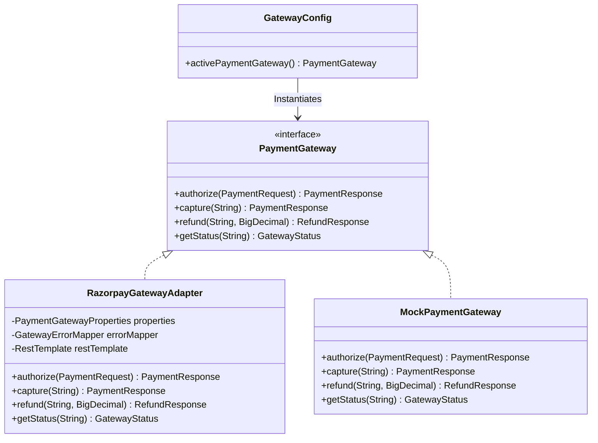
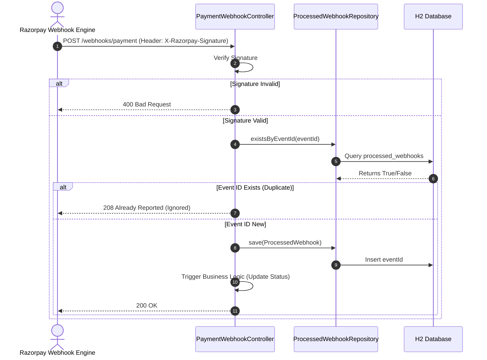

# Design Specification: payment-gateway-adapter

This document defines the architectural patterns, security controls, database schema, exception-handling strategies, and sequence flows for the `payment-gateway-adapter` module.

---

## 1. Architectural Overview

The `payment-gateway-adapter` acts as an **Anti-Corruption Layer (ACL)**. It decouples the core TMF676 Payment Management Service from the specific API contracts, pagination structures, error models, and authentication mechanisms of Razorpay.

### Design Principles
* **Loose Coupling**: The core payment domain communicates exclusively via the abstract `PaymentGateway` strategy interface.
* **Security-First**: Webhook messages are validated before parsing or committing to state changes.
* **Resiliency**: Errors are caught, mapped, and standard TMF676 failure reason codes are returned rather than exposing gateway-specific stack traces.

---

## 2. Component Design & Strategy Pattern

The module utilizes the **Strategy Pattern** to select the active gateway provider dynamically at runtime.



* **`PaymentGateway`**: The core strategy interface.
* **`RazorpayGatewayAdapter`**: Connects to Razorpay Sandbox REST APIs using Basic Auth (`key_id` and `key_secret`).
* **`MockPaymentGateway`**: Returns deterministic success/failure mocks for local development/testing.
* **`GatewayConfig`**: Factory class that reads `payment.gateway.provider` from the configuration and wires the correct Bean as `@Primary`.

---

## 3. Webhook Security & Idempotency Model

### Webhook Signature Verification
To prevent replay attacks and spoofing, Razorpay webhook events are validated using HMAC-SHA256 signature verification.

```text
Computed Signature = HMAC-SHA256( raw_request_body, webhook_secret )
```

The system checks if the hexadecimal representation of the computed signature matches the `X-Razorpay-Signature` request header.

### Idempotency Flow
To handle duplicate webhook event deliveries, we implement the following check-and-insert flow against the database:



---

## 4. Database Schema (H2)

The database schema utilizes an in-memory H2 database for zero-dependency local testing while supporting the JPA data layer:

### `processed_webhooks` Table

| Column Name | Data Type | Constraints | Description |
| :--- | :--- | :--- | :--- |
| `id` | `BIGINT` | `PRIMARY KEY`, `AUTO_INCREMENT` | Internal database surrogate key |
| `event_id` | `VARCHAR(255)` | `UNIQUE`, `NOT NULL` | The unique webhook event ID sent by Razorpay |
| `processed_at` | `TIMESTAMP` | `NOT NULL` | Time when the webhook was successfully parsed and saved |

---

## 5. TMF676 Compliant Error Mapping

Razorpay errors are intercepted in the adapter layer and mapped to standard TMF676 failure reasons using the `GatewayErrorMapper`:

| Razorpay Error Code / Reason | TMF676 Code | HTTP Status | Description |
| :--- | :--- | :--- | :--- |
| `payment_failed` | `PAYMENT_DECLINED` | `400 Bad Request` | Transaction declined by credit card network or issuer bank |
| `insufficient_funds` | `INSUFFICIENT_FUNDS` | `400 Bad Request` | Insufficient account balance |
| `invalid_card` | `INVALID_PAYMENT_METHOD` | `400 Bad Request` | Invalid card details or expired card structure |
| `gateway_timeout` | `PAYMENT_TIMEOUT` | `400 Bad Request` | Timeout occurred during issuer bank processing |
| `fraud_blocked` | `PAYMENT_REJECTED` | `400 Bad Request` | Risk controls or fraud prevention block |
| `BAD_REQUEST_ERROR` | `INVALID_PAYMENT_METHOD` | `400 Bad Request` | General parameters validation failure |
| *Default fallback* | `PAYMENT_DECLINED` | `400 Bad Request` | Unspecified payment transaction decline |

---

## 6. API REST Endpoints

### Handle Webhook
* **URI**: `/tmf-api/paymentManagement/v4/webhooks/payment`
* **Method**: `POST`
* **Content-Type**: `application/json`
* **Headers**: `X-Razorpay-Signature` (HMAC-SHA256 signature hash)
* **Request Payload**: Generic `GatewayWebhookEvent`
* **Response Models**:
  * `200 OK`: Webhook successfully processed.
  * `208 Already Reported`: Duplicate webhook detected, skipped.
  * `400 Bad Request`: Signature validation failure or malformed payload.
